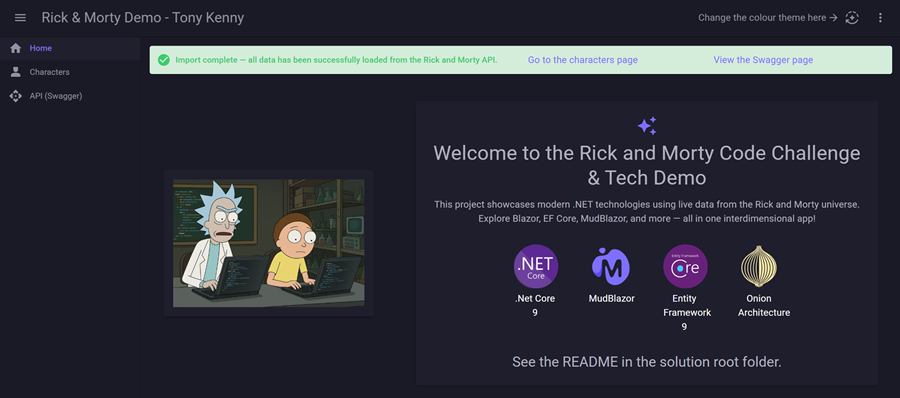
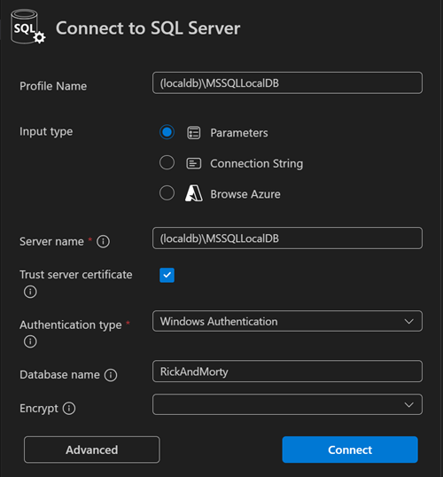

# RickAndMorty2025
Rick And Morty Interview Task 2025

*THIS CODE IS OWNED BY THE AUTHOR AND MUST NOT BE DISTRIBUTED*
THIS REPOSITORY IS KEPT PRIVATE TO HELP AVOID PLAGARISM




# Setup and execution

Ths section aims to guide the reader through the process to run this code sample

## Prerequisites
A computer with dotnet 9.0.201 or later

## Getting started

The steps to get started are straight forward

1. Clone the repositor to your computer
2. Either:
	+ open in your IDE of choice (I use VS),
	+ from command line follow the script below after changign directory to the solution root (where the .sln file sits)
	 
```
dotnet restore
dotnet run --project ./RickAndMorty.Web/
```

Finally, open you browser and got to  http://localhost:5168/

:information_source: The blazor render mode is set to 'InteractiveAuto' which means if your browser supports web assembly then you will run in webassembly node, if not you'll get HTML mode.

:information_source: Hint - if you want to test the caching without waiting 5 minutes, open the appsettings.json in the Web project and change the value of CacheMinutes

:information_source: Do you want to strip the database and start again. This app uses the build in 'localdb'.
You can connect to this from SQL Server Managerment Studio usually as "(localdb)/MSSQLLocalDB" using your local authentication (windows authentication if on windows)
If Visual Studio Code is more your style, then using the SQL Server plugin https://marketplace.visualstudio.com/items?itemName=ms-mssql.mssql
The database name is RickAndMorty. You may need to check the "Trust server certificate" box. 



# Features

## RESTful API
Swagger page can be found at {url}/swagger 

## Caching
Caching is implemented on the characters end point. This has been implemented as an OuputCache in order to make the solution easily executable on another PC without an external dependencies.
However, this would not be ideal for production if more than one instance of the app exists as they will all have their own cache. Instead, consider a distributed cache such as Redis.
This implementation will invalidate the cache when a new character is added.

## Unit tests
Unit test coverage is as follows
Db project - 100%
Serices - 85% - in production we might want to consider testing the remaining items too
DTos - 84%, but these are actuall just models so all we'd be testing here is the dotnet framework itself, so this coverage is by side effect of the services test
Controllers - 0% - these would require integration testing - but if you know a way to do that without having to actually run a server, please tell me (I didn't ask ChatGpt, needed to leave something for us to discuss!)


# Technologies and techniques included

- Asp.net core
- MudBlazor, srever rendered and web assembly
- EntityFramework Core 9
- Swagger
- xUnit
- Moq
- Separation of concerns
- SOLID - kinda, mainly the 'single use', but the whole of SOLID can quickly produce bloated code if we're not careful
- OutputCache
- Fine code coverage - shows unit est code coverage for those of us who can't afford VS Enterprise edition!


# Limitations & Future Improvements

## Clashing character IDs & loss of data
Because we add characters directly in our own database, it is possible that later additional records from the API could clash if they use the same ID.
However, the synchronise process here cleans the database before getting data, which will result in manuallay aded records being lost.
For the purpose of this exercise I have set the ID as the max ID + 1, this is not ideal for many reasons, we can discuss in interview.

## Improved form validation
- Validate URL and Image fields to check they are valid
- Possibly implement image upload

## Database fields need refinement
Not knowing the max sizes of all the fields, for the purpose of this piece I left them all at maximum.
A natural progression from tis would be to determine som max length and then implement them in the EF model and also the DTO validation.

## Unit tests limited
These could be expanded to include
- More data variety
- More records - possibly loaded from json files to keep the unit tests cleaner and more readable
- Sad paths (so far we only check the happy paths)
- Add integration testt for the controllers which are not currently tested

## Caching not combined
The caching on each of the Character functions is separate, meaning if all characters are retrieved from the database, then one is requested by ID, another database hit takes place
Caching could 

## Long running async import process does not have a cancellation token

## Probably others - let's chat about it!

# Use of AI

With the emergence of generative AI, I would be a fool if I did not use it in my work and therefore I used it in this work too. 
This is some of the way it has helped me. It doesn't always produce ideal code and sometimes it's just plain wrong, but it's good enough to be saving me time every day!

- Generating code from scaffold
	+ for example, I created a service, I gave that as a template to ChatGPT along with additional models and it created equivalent services
	+ the same with EF builders, I ave it an exmaple and additional models
- Reminding me things I forgot, for example asking it to create a scaffold XUnit test
- Researching - Microsoft Documentation isn't always the easist to read, IF you can actually find the right one! Instead I ask ChatGPT who has 'read' them all so that saves me time.
- Debugging - pasting code and compile errors to help spot those hard to find bugs (or when I'm just code-blind from staring at it too much)
- Generating test data - this can be a labourious task, instead, I just give ChatGpt the RickAndMorty Api and ask it to generate realistic test data
- Discovering techniques - asking it for a better way to do things, sometimes it comes up with some better method or a new package/feature I didn't know about
- General bouncing of ideas - give it a problem and some options I'm considering to ask for opinions, i don't always follow it's advice, but it's good to 'talk' through a problem with somebody 
- Animateed CSS - I'm a backend specialist, but ChatGTP is 'fullstack' 